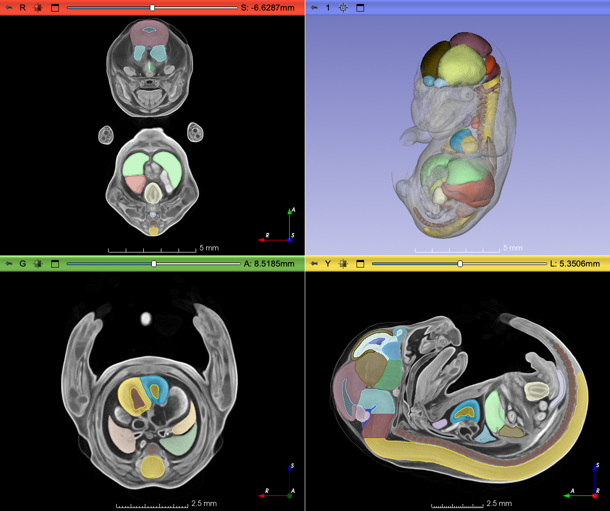

# Release v2

## Previous releases
- [v1](https://github.com/MorphoDepot/mus-musculus-E15/blob/pre-release-v2/README.md)

## MorphoDepot Repository
Repository for segmentation of a specimen scan. See [this JSON file](MorphoDepotAccession.json) for specimen details.
* Species: Mus musculus
* Modality: Micro CT (or synchrotron)
* Contrast: Yes
* Dimensions: (594, 1046, 738)
* Spacing (mm): (0.017999999225139618, 0.017999999225139618, 0.017999999225139618)

## Screenshots

## Contributors

**Authors**

| Name | ORCID |
|---|---|
| Maga, A. Murat | 0000-0002-7921-9018 |
| Roston, Rachel | 0000-0002-1958-4849 |

<!-- MORPHODEPOT-DOI:START -->
## Citation & DOI

**Cite this release:**

> Maga, A. Murat; Roston, Rachel (2026). MorphoDepot/mus-musculus-E15 — MorphoDepot segmentation dataset (v2) [Data set]. Zenodo. https://doi.org/10.5281/zenodo.21816003

To cite *all* versions (always resolves to the latest), use the concept DOI: <https://doi.org/10.5281/zenodo.21816002>

*(This block is regenerated on every release — the version DOI above changes each time.)*
<!-- MORPHODEPOT-DOI:END -->
